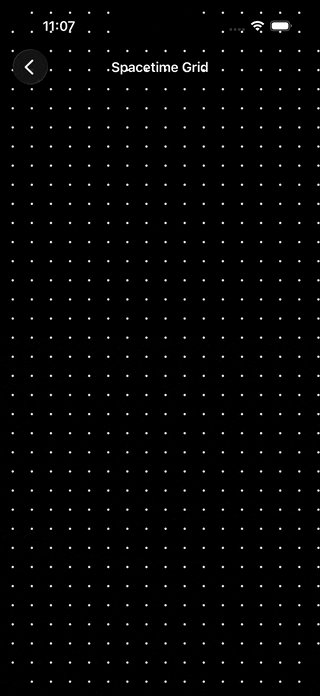
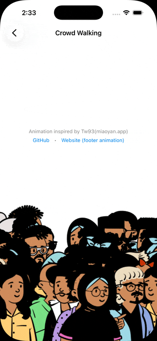
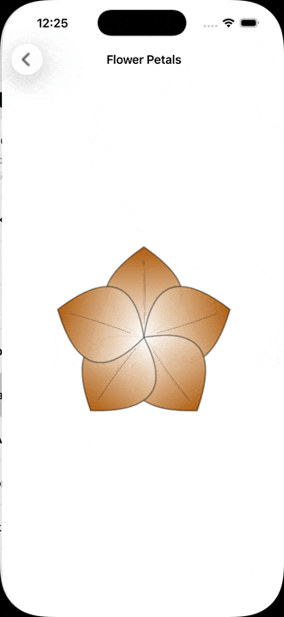
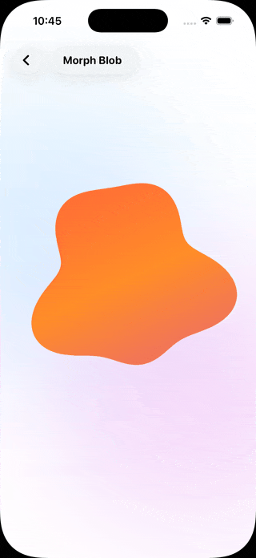
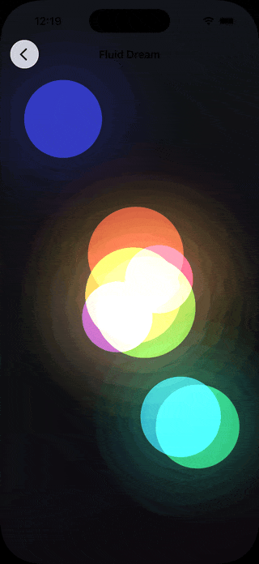

# SwiftUI-Animations

## Overview

This repository contains a collection of experimental SwiftUI animations created to explore and enhance user experience in iOS apps.

## Animations

<table>
  <tr>
    <td></td>
    <td></td>
    <td></td>
    <td></td>
  </tr>
  <tr>
  <td></td>
    <td></td>
    <td></td>
    <td></td>
   
  </tr>
  <tr>
    <td></td>
    <td></td>
    <td></td>
    <td></td>
  </tr>
  <tr>
  <td></td>
  <td></td>
  <td></td>
    <td></td>
  </tr>
</table>

## License
This project is licensed under the **MIT License**.

