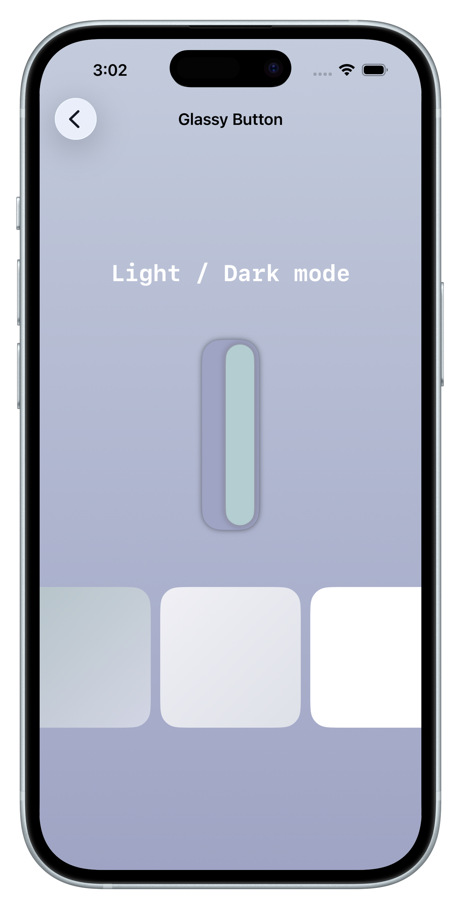
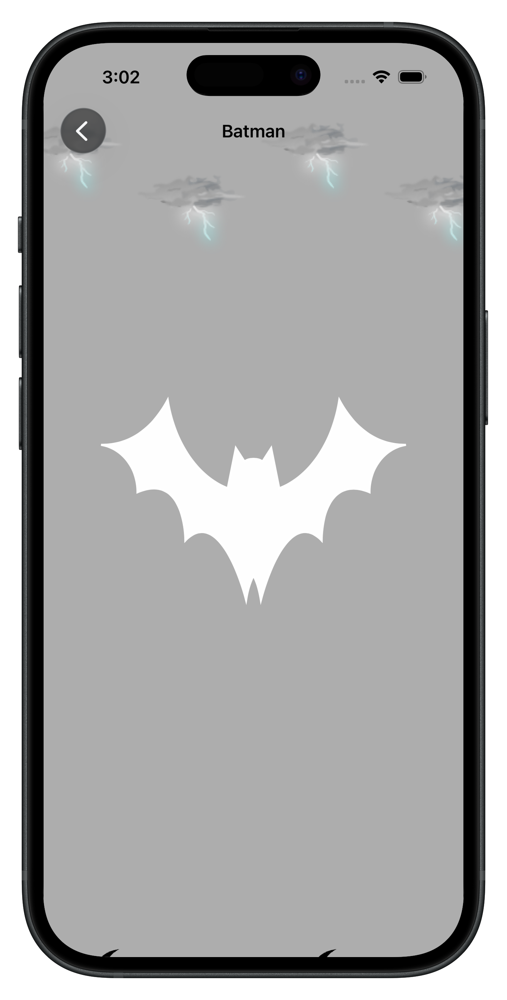
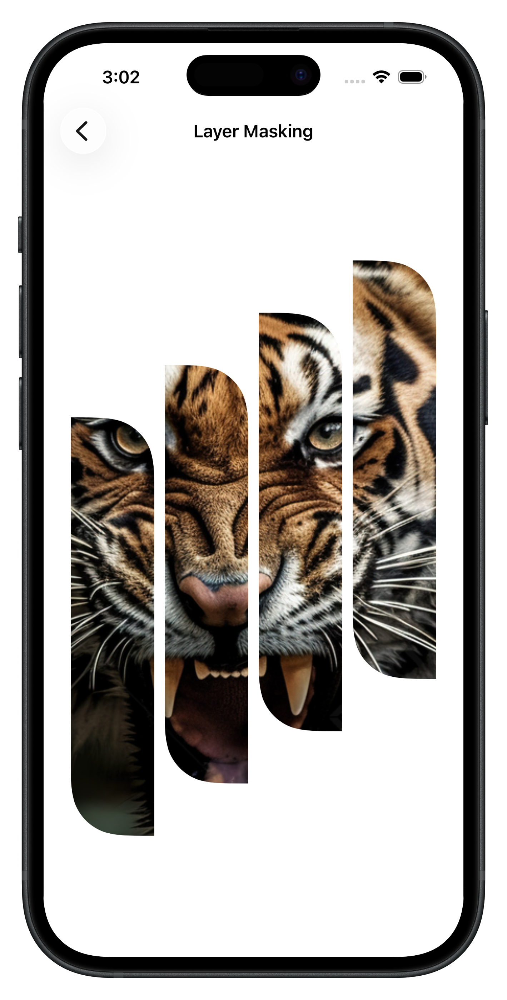
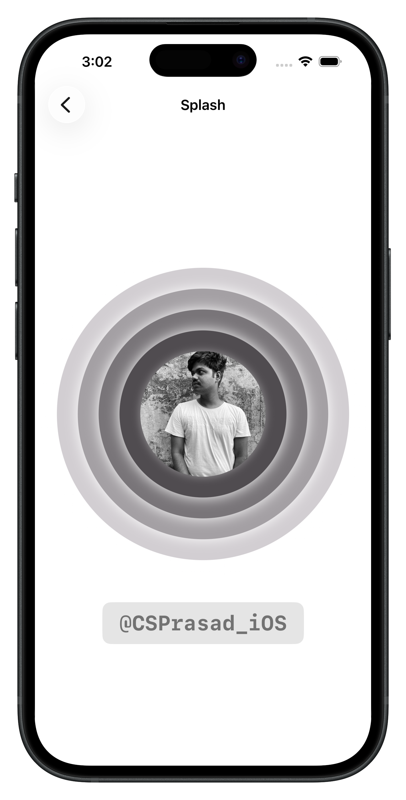
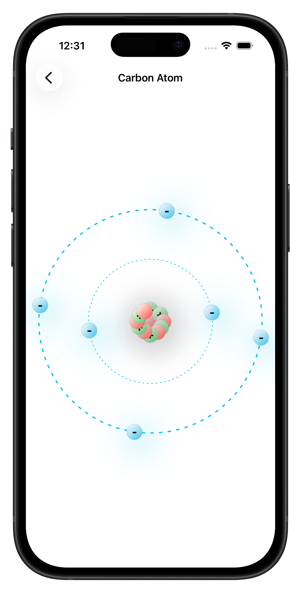
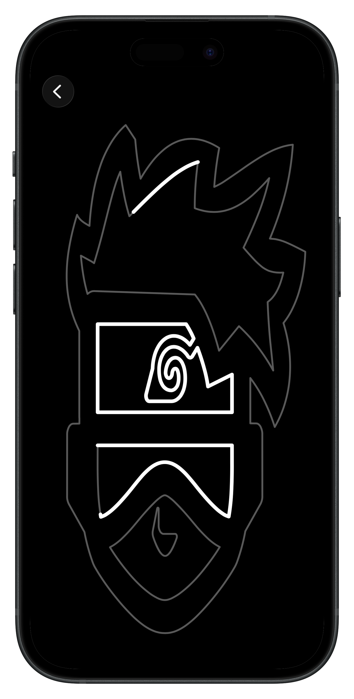

# SwiftUI-Animations

## Overview

This repository contains a collection of SwiftUI animations designed to enhance the user experience in iOS apps.

## Animations

The current version of the project includes the following SwiftUI animations:

1. Fade In and Out: A smooth fade-in and fade-out effect for views.
2. Bounce Animation: Add a playful bounce effect to your elements.
3. Slide In and Out: Slide views in and out from the edges of the screen.
4. Pulse Animation: Create a pulsating effect for a dynamic UI element.
5. Scale Animation: Scale views in and out to create emphasis.

## Getting Started

To use these animations in your SwiftUI project, follow these steps:

1. Clone this repository to your local machine.
2. Open the Xcode project.
3. Copy the relevant animation code from the "Animations" folder into your project.

## Examples

<table>
  <tr>
    <td></td>
    <td></td>
    <td></td>
    <td></td>
  </tr>
  <tr>
    <td></td>
    <td></td>
    <td></td>
    <td></td>
  </tr>
</table>

## License
This project is licensed under the **MIT License**.

