# SwiftUI-Animations

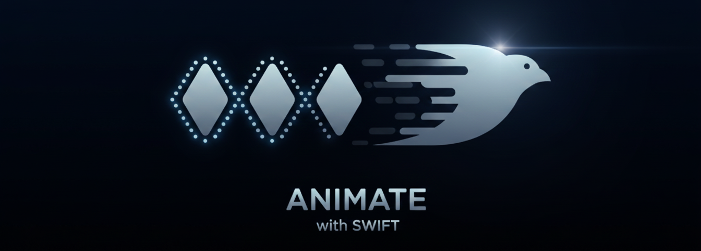

## Overview

This repository contains a collection of experimental SwiftUI animations created to explore and enhance user experience in iOS apps.

## Animations

<table>
  <tr>
    <td width="25%">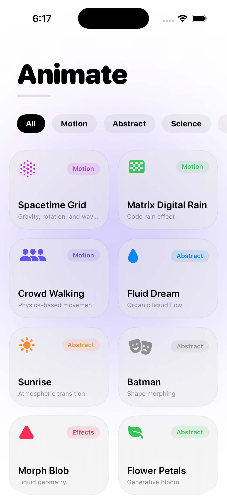</td>
    <td>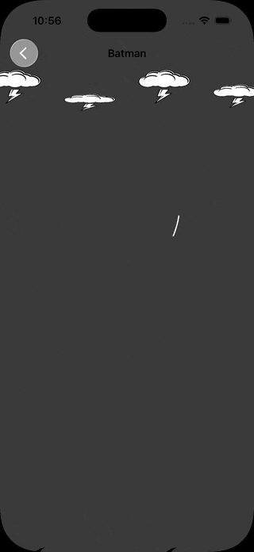</td>
    <td>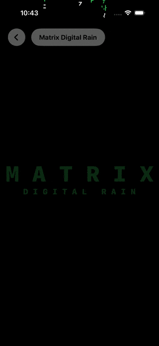</td>
    <td>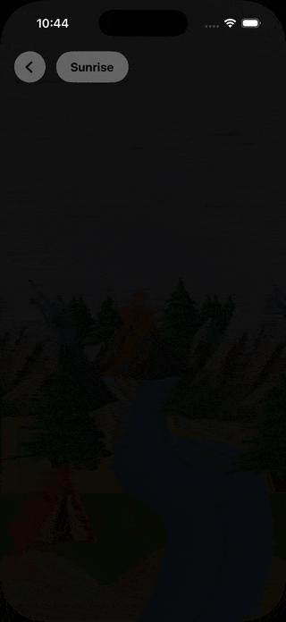</td>
  </tr>
  <tr>
    <td>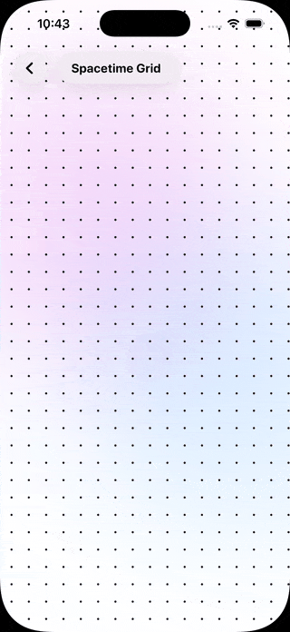</td>
    <td>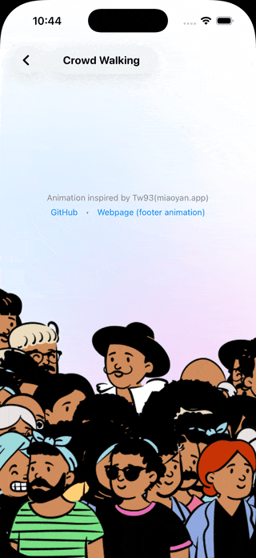</td>
    <td>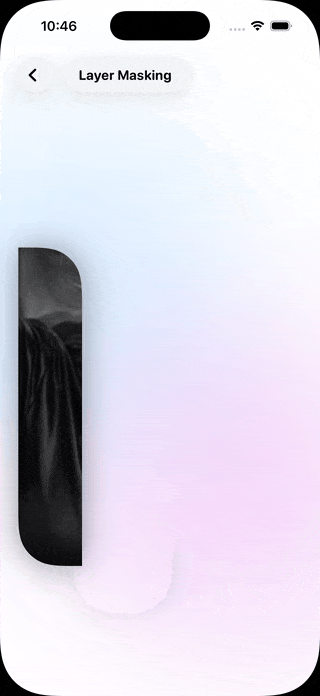</td>
    <td>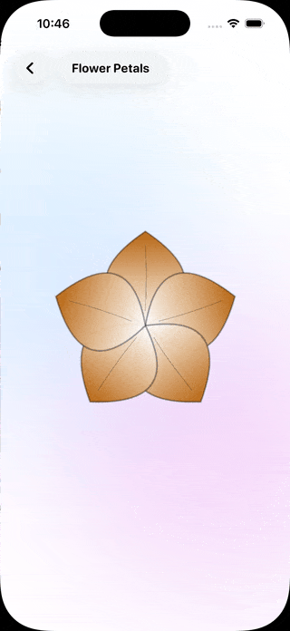</td>
  </tr>
  <tr>
    <td>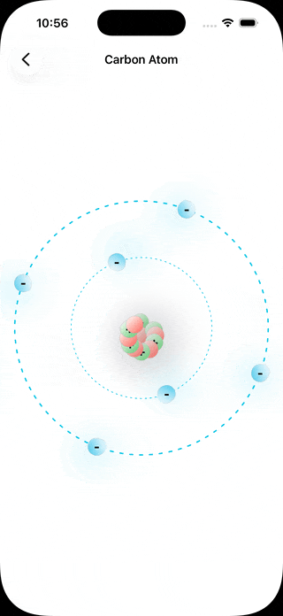</td>
    <td>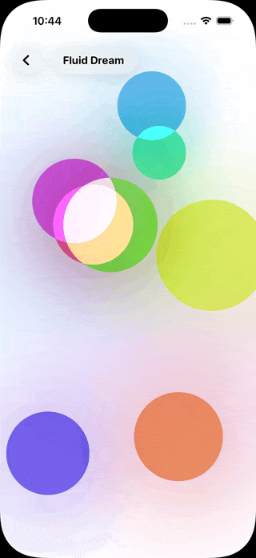</td>
    <td>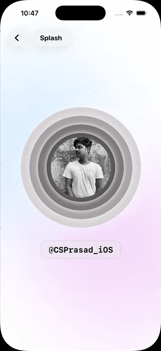</td>
    <td>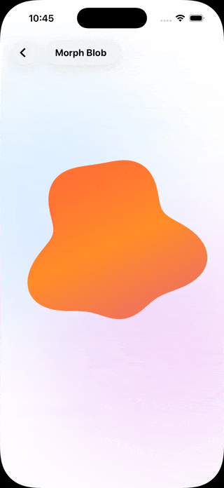</td>
  </tr>
  <tr>
    <td>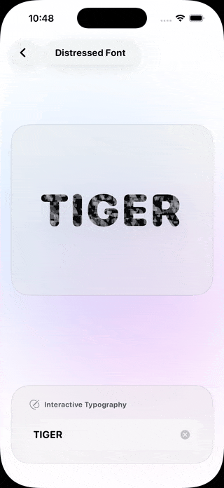</td>
    <td>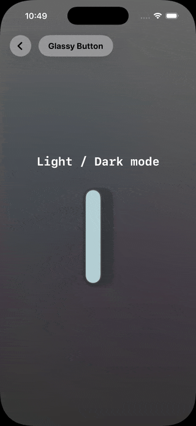</td>
    <td>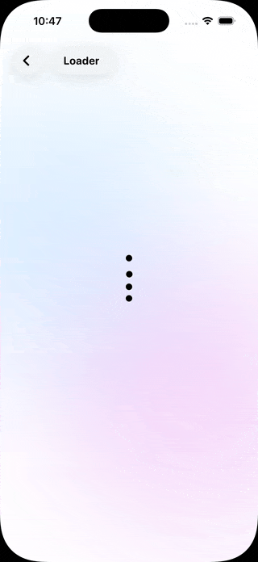</td>
    <td>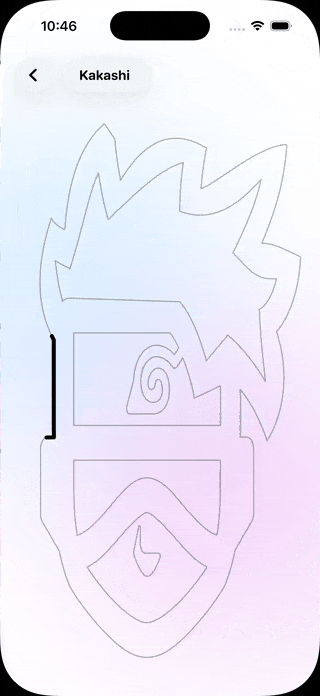</td>
  </tr>
</table>

## License
This project is licensed under the **MIT License**.

