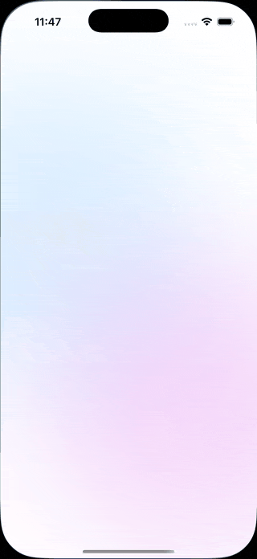
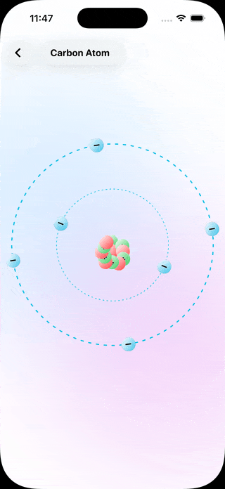

# Experiments

## Collections

<table>
<tr>

<td width="75%" valign="top">

Animated showcase screen combining a launch-style intro with previews of multiple SwiftUI animation experiments.

### Technical Notes
- Animated launch transition sequence
- Combined preview system for multiple animations
- Modular navigation between experiments
- Shared animation composition structure
- Coordinated timing and motion transitions
- Acts as a visual entry point for the project

</td>

<td width="25%" align="center">

</td>

</tr>
</table>

## Batman

<table>
<tr>

<td width="75%" valign="top">

Stylized cinematic logo animation experiment.

### Technical Notes
- Glow and masking effects
- Opacity-driven transitions
- Layered compositing structure
- Scale animation timing
- Dramatic visual motion styling

</td>

<td width="25%" align="center">

</td>

</tr>
</table>

## Matrix Rain

<table>
<tr>

<td width="75%" valign="top">

Procedural Matrix-inspired digital rain effect rendered entirely in SwiftUI.

### Technical Notes
- Canvas-rendered text streams
- Timeline-based procedural updates
- Dynamic multilingual symbol generation
- Opacity fading for glow simulation
- Continuous vertical motion system

</td>

<td width="25%" align="center">

</td>

</tr>
</table>

## Sunrise

<table>
<tr>

<td width="75%" valign="top">

Atmospheric sunrise-inspired visual animation.

### Technical Notes
- Gradient interpolation effects
- Layered scaling transitions
- Procedural movement timing
- Continuous rendering updates
- Atmospheric depth composition

</td>

<td width="25%" align="center">

</td>

</tr>
</table>

## Space Grid

<table>
<tr>

<td width="75%" valign="top">

Perspective-inspired animated grid simulation.

### Technical Notes
- Layered transform animations
- Depth simulation through scaling
- Timeline-driven movement updates
- Procedural spatial motion
- Continuous offset rendering

</td>

<td width="25%" align="center">

</td>

</tr>
</table>

## Crowd Walk

<table>
<tr>

<td width="75%" valign="top">

Looping crowd movement experiment with synchronized motion patterns.

### Technical Notes
- Staggered timing systems
- Offset-driven character animation
- Lightweight repeated motion structures
- Procedural movement variation
- Reusable animation composition

</td>

<td width="25%" align="center">

</td>

</tr>
</table>

## Layer Mask

<table>
<tr>

<td width="75%" valign="top">

Layer compositing and masking experiment using animated transitions.

### Technical Notes
- Dynamic masking effects
- Layered opacity transitions
- Animated reveal systems
- Blend-based visual composition
- Reusable masking structures

</td>

<td width="25%" align="center">

</td>

</tr>
</table>

## Petal

<table>
<tr>

<td width="75%" valign="top">

Procedural rotational petal-style motion experiment.

### Technical Notes
- Repeated rotational transforms
- Layered movement offsets
- Continuous flowing motion timing
- Scaling and opacity depth effects
- Procedural animation structure

</td>

<td width="25%" align="center">

</td>

</tr>
</table>

## Carbon

<table>
<tr>

<td width="75%" valign="top">

Texture-inspired animated visual effect experiment.

### Technical Notes
- Procedural opacity transitions
- Dynamic gradient composition
- Layered atmospheric rendering
- Continuous motion variation
- Abstract visual styling system

</td>

<td width="25%" align="center">

</td>

</tr>
</table>

## Fluid Dream

<table>
<tr>

<td width="75%" valign="top">

Interactive fluid-style motion experiment built using `Canvas` and `TimelineView`.

### Technical Notes
- Procedural blob movement
- Blend mode glow rendering
- Dynamic touch interactions
- Timeline-driven animation updates
- Layered gradient composition

</td>

<td width="25%" align="center">

</td>

</tr>
</table>

## Splash

<table>
<tr>

<td width="75%" valign="top">

Splash-style expansion animation using layered transitions.

### Technical Notes
- Scale and opacity animation system
- Spring-driven motion timing
- Particle-style expansion effects
- Layered visual composition
- Reusable interaction animation pattern

</td>

<td width="25%" align="center">

</td>

</tr>
</table>

## Morph Blob

<table>
<tr>

<td width="75%" valign="top">

Organic shape morphing experiment exploring fluid motion patterns.

### Technical Notes
- Animated path interpolation
- Dynamic control point movement
- Procedural motion offsets
- Gradient blending effects
- Spring-based animation timing

</td>

<td width="25%" align="center">

</td>

</tr>
</table>

## Distress

<table>
<tr>

<td width="75%" valign="top">

Experimental glitch-inspired visual effect animation.

### Technical Notes
- Distortion and offset transitions
- Irregular procedural timing
- Layered opacity composition
- Stylized glitch rendering
- Dynamic motion disruption effects

</td>

<td width="25%" align="center">

</td>

</tr>
</table>

## Glassy Button

<table>
<tr>

<td width="75%" valign="top">

Interactive glassmorphism-inspired button component.

### Technical Notes
- Blur and translucency depth effects
- Animated press feedback interactions
- Gradient and overlay composition
- Dynamic scaling transitions
- Reusable interactive component structure

</td>

<td width="25%" align="center">

</td>

</tr>
</table>

## Vertical Loader

<table>
<tr>

<td width="75%" valign="top">

Animated vertical loading indicator with repeated motion patterns.

### Technical Notes
- Staggered timing animations
- Opacity and scaling transitions
- Lightweight reusable loader system
- Continuous looping motion updates
- Minimal procedural animation structure

</td>

<td width="25%" align="center">

</td>

</tr>
</table>

## Kakashi

<table>
<tr>

<td width="75%" valign="top">

Anime-inspired atmospheric motion and visual styling experiment.

### Technical Notes
- Animated overlay composition
- Glow and masking effects
- Layered atmospheric gradients
- Opacity transition systems
- Cinematic motion styling

</td>

<td width="25%" align="center">

</td>

</tr>
</table>

